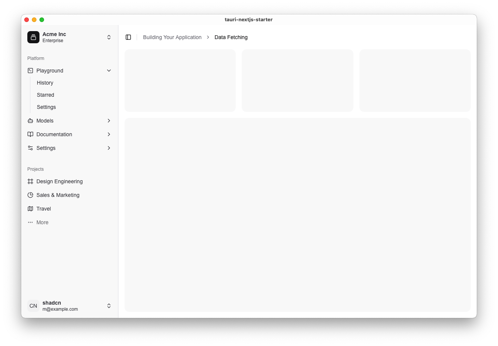

# Tauri + Next.js 启动模板

[English](./README.en.md) | 中文

一个使用 Tauri 2.0 和 Next.js 构建的现代桌面应用程序启动模板,具有精美的 UI 设计。



## ✨ 特性

- 🦀 使用 Rust 和 Tauri 2.0 构建的高性能后端
- ⚡️ 基于 Next.js 的快速响应式前端
- 🎨 使用 Tailwind CSS 和 shadcn/ui 构建的现代 UI
- 📦 开箱即用的侧边栏导航组件
- 🌗 支持亮色/暗色主题切换
- 📱 响应式设计,支持移动端和桌面端
- 🔒 内置安全配置
- 🚀 使用 Turbopack 进行快速开发

## 🛠️ 技术栈

- [Tauri 2.0](https://tauri.app/) - 桌面应用程序框架
- [Next.js](https://nextjs.org/) - React 框架
- [Tailwind CSS](https://tailwindcss.com/) - CSS 框架
- [shadcn/ui](https://ui.shadcn.com/) - UI 组件库
- [Lucide Icons](https://lucide.dev/) - 图标库

## 🚀 开始使用

确保你已安装:

- [Node.js](https://nodejs.org/) (v18+)
- [Rust](https://www.rust-lang.org/) (v1.77+)
- [pnpm](https://pnpm.io/) (v8+)

## 📦 安装依赖

```bash
pnpm install
```

## 🚀 运行项目

```bash
pnpm tauri dev
```

## 🚀 构建项目

```bash
pnpm tauri build
```

## 📄 许可证

MIT
